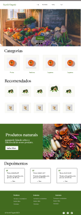
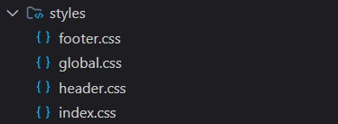
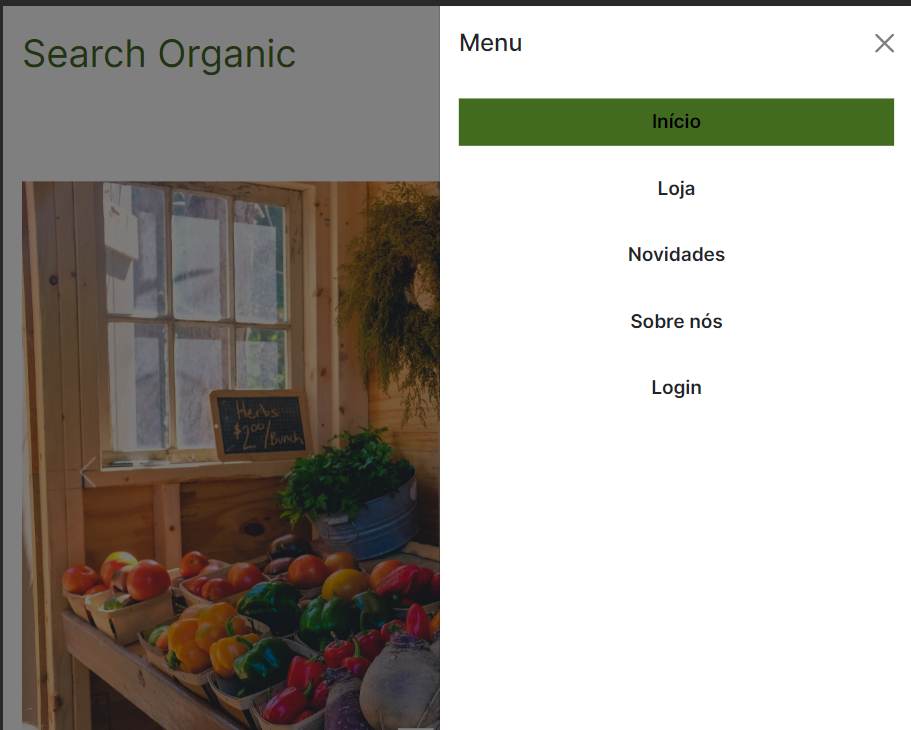
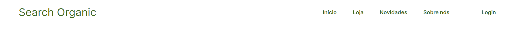
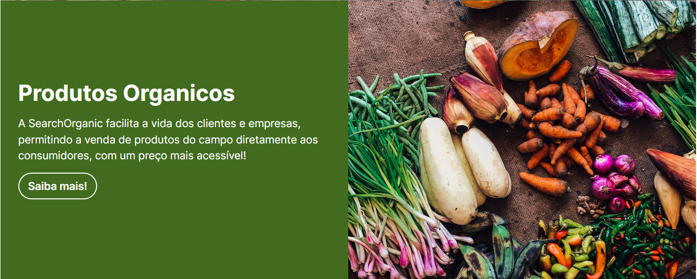
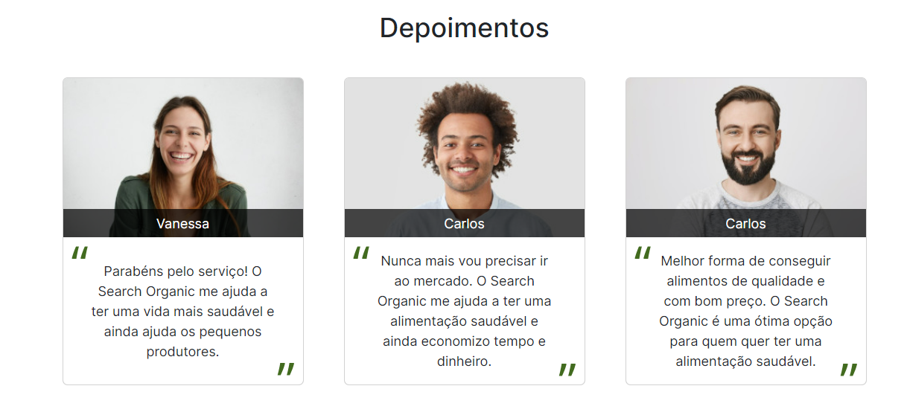
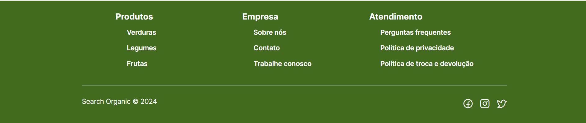

<h1 align="center"> Search Organic </h1>

<p align="center">
    Task de prototipação e criação de uma Landing Page para o nosso projeto de ODS.
 <br/>
</p>

## 🚀 Tecnologias

Esse projeto foi desenvolvido com as seguintes tecnologias:

- HTML
- CSS
- Bootstrap
- Unsplash & phosphoricons

## ⚙️ Instalação do projeto

Passo-a-passo:

1. Comandos necessários para executar:

```
git clone repositorio
cd rep
code .
Open With Live Server
```

# Search Organic

Nosso projeto consiste em uma aplicação que facilita o processo de compras de alimentos orgânicos diretamente dos fabricantes, eliminando a necessidade de intermediários, como centros de distribuição de alimentos, como o Ceasa.

# Prototipação

Realizamos a prototipação da nossa página no Figma. Como já tínhamos esboçado anteriormente o design do nosso produto, seguimos esse padrão, mantendo as cores, fontes e logos.

<div align="center">

</div>

[Link do Figma](https://www.figma.com/file/g9EQCcdJltWSkpHUZFdRUR/Figma-basics?type=design&node-id=1669-162202&mode=design&t=Aae3Gx8fPC9xboKg-0)

# Codificação da Landing Page

Dividimos as tarefas de forma que cada membro da equipe pudesse responsabilizar-se por uma seção proposta no Figma.

Optamos por separar os arquivos CSS do footer e do header, considerando que serão reutilizados em futuras páginas.



Conforme recomendado na tarefa, asseguramos que nosso site atendesse aos critérios de acessibilidade e boas práticas. Para garantir isso, realizamos avaliações regulares utilizando o Google Lighthouse.

Para a implementação do menu hamburger no header em dispositivos móveis, no carrossel e nos cards de depoimentos e produtos, decidimos utilizar o framework Bootstrap. Isso nos proporcionou uma abordagem consistente e eficaz para esses elementos, facilitando a manutenção e garantindo uma experiência responsiva.

<h3>Menu Hamburger</h3>


Também utizamos efeitos para que a expereincia do usuario seja mais responsiva como hover em links por
exemplo.

## Seções

# Header

O menu de navegação entre as futuras páginas, o botão de login e o nome da empresa estão contidos nesta seção.



# Carousel

Esta seção apresenta um carrossel com imagens relacionadas ao propósito da nossa aplicação, um texto chamativo e um botão para que os usuários possam obter mais informações.

# Categorias

Nesta parte, oferecemos um conjunto de cards que permite aos usuários buscar alimentos por categorias, facilitando a navegação e a localização dos produtos desejados.

# Recomendações

Apresentamos uma lista de cards com recomendações dos principais produtos ou lojas do momento em nosso sistema, proporcionando aos usuários insights valiosos sobre as escolhas populares.

# Propaganda

Nesta seção, um grid foi dividido com uma imagem relacionada ao nosso produto e um texto destacando o nosso diferencial para potenciais clientes.



# Depoimentos

Criamos uma seção com cards com o intuito de transmitir aos clientes uma maior credibilidade sobre o nosso produto, apresentando avaliações positivas de usuários anteriores.



# Footer

Por fim, implementamos um rodapé com links para outras páginas e nossas redes sociais, oferecendo uma navegação completa e facilitando o contato com a comunidade.


